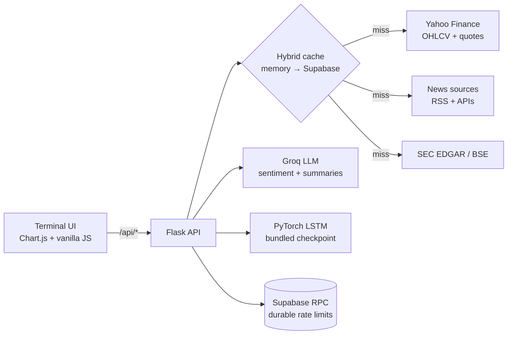

<div align="center">

# 📈 Stock Screen

**A free, open-source Bloomberg-style terminal for stock sentiment, news, SEC filings, and AI forecasting.**

Type a ticker. Get a verdict — bullish/bearish signal, catalysts, risks, filing summaries, and an AI price forecast — in seconds.

[](https://stock-screen-25476982226.us-central1.run.app/)
[](LICENSE)
[](https://python.org)
[](https://flask.palletsprojects.com)
[](https://supabase.com)

*If Stock Screen saves you a research session, consider giving it a ⭐ — it helps others find the project.*

</div>

---

## Why Stock Screen?

Institutional traders get Bloomberg terminals. Retail investors get twelve browser tabs. Stock Screen closes that gap with a single dark-terminal dashboard that does the reading for you:

| | Feature | What you get |
|---|---|---|
| 🧠 | **AI Sentiment Verdicts** | Every headline scored by an LLM (Groq Llama 3.3 70B), rolled up into a bullish/bearish/neutral signal with confidence, catalysts, and risks — with a finance-lexicon fallback so the app never goes blank |
| 📰 | **Multi-Source News Wire** | Yahoo Finance, Google News RSS, MarketWatch, Finnhub, NewsAPI, and Alpha Vantage — deduplicated, relevance-ranked, merged into one feed |
| 🏛️ | **Filing Intelligence** | SEC EDGAR (10-K / 10-Q / 8-K) **and** Indian BSE/NSE disclosures, with AI summaries, filing timelines, and cadence stats |
| 🔮 | **AI Price Forecasts** | A bundled deep-learning model turns 60 days of OHLCV into a 5-day projection with confidence bands, bull/bear cases, and backtest MAE |
| 📊 | **Live Terminal UI** | Ticker tape, market movers with sparklines, world clocks, technical overlays (SMA/EMA/Bollinger/RSI/MACD), sentiment-vs-price divergence |
| 🌏 | **Two Markets** | US (NYSE/Nasdaq) and India (NSE/BSE) with the right currency, indices, and filing sources per market |
| ⭐ | **Accounts & Watchlists** | Free sign-in (email + password, server-side sessions) with a personal watchlist that follows you across devices — one click to watch any stock from its analysis page |

**[→ Try the live demo](https://stock-screen-25476982226.us-central1.run.app/)** — no signup, no API key needed to browse.

---

## Quickstart

```bash
git clone https://github.com/pranavdhawann/stock-screen.git
cd stock-screen

python -m venv .venv
source .venv/bin/activate        # Windows: .\.venv\Scripts\Activate.ps1

pip install -r requirements-dev.txt
cp .env.example .env             # Windows: Copy-Item .env.example .env

flask --app app:create_app run
```

Open http://127.0.0.1:5000 — market data and news work out of the box with **zero API keys** (Yahoo Finance + free RSS feeds). Add keys as you need more:

| Env var | Unlocks | Required? |
|---|---|---|
| `GROQ_API_KEY` | AI sentiment, insights, filing summaries | Recommended (free tier works) |
| `SECRET_KEY` | Session security | Required in production |
| `SUPABASE_URL` + `SUPABASE_SERVICE_KEY` | Persistent cache + durable rate limits | Optional (falls back to in-memory) |
| `FINNHUB_API_KEY`, `NEWSAPI_KEY`, `ALPHAVANTAGE_API_KEY` | Extra news sources | Optional |
| `EMAILJS_SERVICE_ID` / `_TEMPLATE_ID` / `_PUBLIC_KEY` | Contact form delivery | Optional |
| `SEC_EDGAR_USER_AGENT` | Identifies you to SEC EDGAR (their policy) | Recommended |
| `PRO_MONTHLY_PAYMENT_LINK`, `PRO_ANNUAL_PAYMENT_LINK` | Hosted checkout URL returned when a visitor requests a Pro payment link | Optional |
| `PRO_MONTHLY_PRICE`, `PRO_ANNUAL_PRICE` | Display price for each Pro plan | Optional (defaults shown in-app) |

All variables are documented in [`.env.example`](.env.example). `MAX_CONTENT_LENGTH` (default 1 MiB) caps request bodies; an invalid value falls back to the default rather than failing startup.

**Client identity for rate limits.** Set `TRUST_PROXY_HEADERS=true` only behind a trusted proxy. Cloud Run appends the real client IP as the *last* entry of `X-Forwarded-For`, so the app reads that header from the right, not the left — every entry to its left is client-supplied and forgeable. `TRUSTED_PROXY_HOPS` (default `1`) selects how many positions from the end to read: leave it at `1` for a direct Cloud Run deployment, and increase it only if you put another trusted reverse proxy in front. A missing or out-of-range value falls back to the immediate connection address rather than trusting a forgeable header. With `TRUST_PROXY_HEADERS=false` behind a proxy, every visitor collapses into a single rate-limit bucket — the per-client quotas below stop being per-client.

---

## How It Works



- **Hybrid caching** — reads hit an in-memory TTL cache first, then Supabase, then the network. Writes persist to Supabase on a background worker so requests never wait. Without Supabase credentials everything degrades gracefully to memory-only.
- **Durable quotas** — expensive endpoints (AI analysis, forecasts, contact) are rate-limited through a Postgres RPC with advisory locks, so limits survive restarts and hold across instances. A pg_cron job prunes expired cache and quota rows hourly.
- **Graceful degradation** — no Groq key (or a tripped key) falls back to a finance-tuned lexicon analyzer and extractive summaries via a process-wide circuit breaker.
- **Hardened by default** — CSP with per-request script nonces, SRI-pinned CDNs, strict security headers, SSRF-safe filing-URL allowlists, honeypot contact form, and a 3300-line regression/security test suite.

```
app/             Flask routes, services, config
lstm/            PyTorch forecaster + feature engineering (+ training CLI in cli_legacy/)
static/, templates/  Terminal UI (vanilla JS + Chart.js, no build step)
supabase/migrations/ Schema, RLS policies, rate-limit RPC, cron cleanup
tests/           Regression + security suite (pytest)
```

## API Rate Limits

Public-demo budgets, enforced server-side per client:

| Bucket | Endpoints | Limit |
|---|---|---|
| `public_news` | `/api/news`, `/api/market_news`, `/api/finnhub_news` | 60/hour |
| AI buckets | `/api/analyze_sentiment`, `/api/indicators/*`, filing summaries/overviews | 20/hour |
| `forecast` | `/api/forecast` | 1 per 30 days |
| `contact` | `/api/contact` | 5/hour |
| `auth_signup` / `auth_login` | `/api/auth/*` | 5/hour · 10 per 15 min |
| `watchlist` | `/api/watchlist` mutations | 60/hour |
| `pro_request` | `/api/pro/payment-link` | 5/hour |

Source code proves which providers are wired and how they're limited; check each vendor dashboard for the connected account's plan.

## Tests

```bash
python -m pytest -q          # 225 regression + security tests
python -m compileall app lstm
```

The suite covers startup safety, server-side quota enforcement, XSS/SSRF hardening, cache cleanup contracts, Supabase migration invariants, and LSTM checkpoint loading safeguards.

---

## Deployment

### Docker

```bash
docker build -t stock-screen .
docker run --env-file .env -p 8080:8080 stock-screen
```

The container runs Gunicorn as a non-root user and fails fast if `SECRET_KEY` is missing in production.

### GCP Cloud Run Release Contract

The live deployment is GCP Cloud Run (deployed automatically from `main` via GitHub Actions with keyless WIF auth). Do not deploy secret values as plain environment variables — store `SECRET_KEY`, `GROQ_API_KEY`, `SUPABASE_URL`, `SUPABASE_SERVICE_KEY`, and other provider keys in Secret Manager and wire them with `--set-secrets` or `--update-secrets`.

Use a dedicated runtime service account with only `roles/secretmanager.secretAccessor` on the secrets this service reads:

```powershell
gcloud services enable secretmanager.googleapis.com
gcloud iam service-accounts create infoedge-runner --display-name "Stock Screen Cloud Run runtime"
gcloud secrets add-iam-policy-binding infoedge-secret-key `
  --member serviceAccount:infoedge-runner@PROJECT_ID.iam.gserviceaccount.com `
  --role roles/secretmanager.secretAccessor

gcloud run deploy stock-screen `
  --region us-central1 `
  --source . `
  --service-account infoedge-runner@PROJECT_ID.iam.gserviceaccount.com `
  --set-env-vars FLASK_ENV=production,LOG_LEVEL=INFO,TRUST_PROXY_HEADERS=true,TRUSTED_PROXY_HOPS=1,MAX_CONTENT_LENGTH=1048576 `
  --set-secrets SECRET_KEY=infoedge-secret-key:latest,GROQ_API_KEY=infoedge-groq-api-key:latest,SUPABASE_URL=infoedge-supabase-url:latest,SUPABASE_SERVICE_KEY=infoedge-supabase-service-key:latest `
  --allow-unauthenticated
```

Rotate any key that was ever configured as a plain env var before relying on Secret Manager references. For stronger public protection, front Cloud Run with an HTTPS load balancer + Cloud Armor and set ingress to `internal-and-cloud-load-balancing`.

---

## Roadmap

- [x] Multi-source news + AI sentiment verdicts
- [x] SEC EDGAR + BSE/NSE filing intelligence
- [x] AI forecasting with confidence bands
- [x] Accounts + cross-device watchlists
- [x] Pro plan catalogue + payment-link requests
- [ ] Watchlist alerts (sentiment flips, volume spikes)
- [ ] Self-serve Pro checkout (automatic entitlement on payment)
- [ ] More markets and symbols

Have an idea? [Open a feature request](https://github.com/pranavdhawann/stock-screen/issues/new/choose).

## Contributing

Issues and PRs are welcome — see **[CONTRIBUTING.md](CONTRIBUTING.md)** for setup, project map, and ground rules, and **[SECURITY.md](SECURITY.md)** for reporting vulnerabilities. Good first contributions:

- 📈 Add symbols to the stock directory (`app/config.py`)
- 🌐 New news sources (implement a fetcher in `app/services/news_aggregator.py`)
- 🧪 More regression tests (`tests/`)
- 🎨 Terminal UI polish (keep it dense, keep it dark)

Run `python -m pytest -q` before submitting; the suite is fast and guards the security posture.

## License

MIT — see [LICENSE](LICENSE).

**Disclaimer:** Stock Screen is for informational and educational purposes only. It is not financial advice. Markets are risky; models are wrong; do your own research.

---

<div align="center">
  <a href="https://stock-screen-25476982226.us-central1.run.app/"><strong>▶ Try the Live Demo</strong></a>
  &nbsp;·&nbsp;
  <a href="https://github.com/pranavdhawann/stock-screen/issues">Report a bug</a>
  &nbsp;·&nbsp;
  <a href="https://github.com/pranavdhawann/stock-screen/issues">Request a feature</a>
</div>
